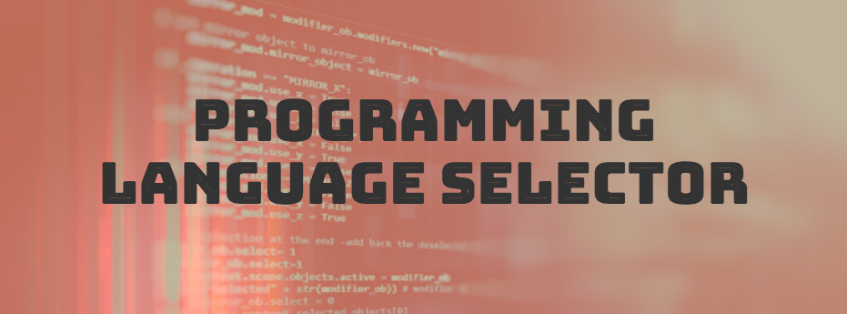

#### Bootstrap, JavaScript, and jQuery Exercise for Epicodus, 06.05.2020

### By Kate Skorija

## Description

This website showcases a form that will suggest which programming language the user should learn: Ruby, C#, JavaScript, or Python. You may view the published site on [GitHub Pages](https://kate-skorija.github.io/language-selector/).

## Setup/Installation Requirements

Software Requirements:

1.  Internet browser

2.  A code editor, such as Visual Studio Code, to view or edit the code base

To Open:

1.  Navigate to the [language-selector respository](https://github.com/kate-skorija/language-selector) or open your terminal

2. Clone this project using the GitHub button or the command:
`$ git clone https://github.com/kate-skorija/language-selector.git`

3. Navigate to the `language-selector` directory in your editor of choice, or use [Visual Studio Code](https://code.visualstudio.com/)

4. Open in the browser of your choice by dragging and dropping the `index.html` file into a browser window

## Known Bugs

There are no known bugs at this time.

## Support and Contact Details

If there are any issues or questions, please reach out to me through [my GitHub account](https://github.com/kate-skorija). 

## Technologies Used

*  [Visual Studio Code](https://code.visualstudio.com/)
*  [Markdown](https://daringfireball.net/projects/markdown/)
*  [HTML](https://developer.mozilla.org/en-US/docs/Web/Guide/HTML/HTML5)
*  [CSS](https://developer.mozilla.org/en-US/docs/Glossary/CSS)
*  [Bootstrap](https://developer.mozilla.org/en-US/docs/Glossary/Bootstrap)
*  [JavaScript](https://developer.mozilla.org/en-US/docs/Web/JavaScript)
*  [jQuery](https://developer.mozilla.org/en-US/docs/Glossary/jQuery)

### License

*This project uses the following license: [MIT](https://opensource.org/licenses/MIT)*

Copyright (c) 2020 **_Kate Skorija_**